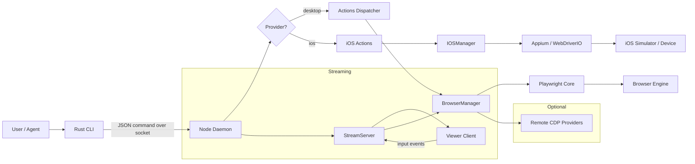
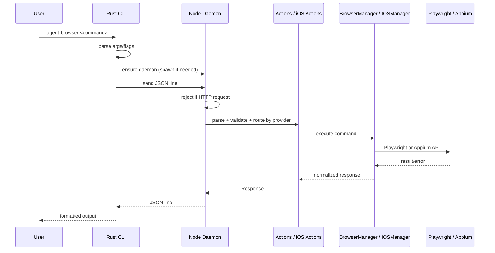
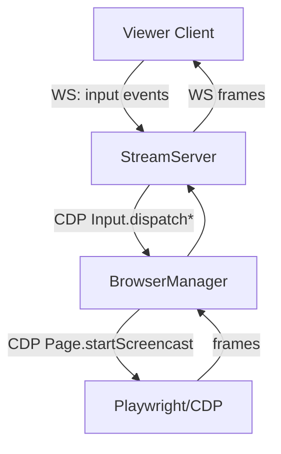
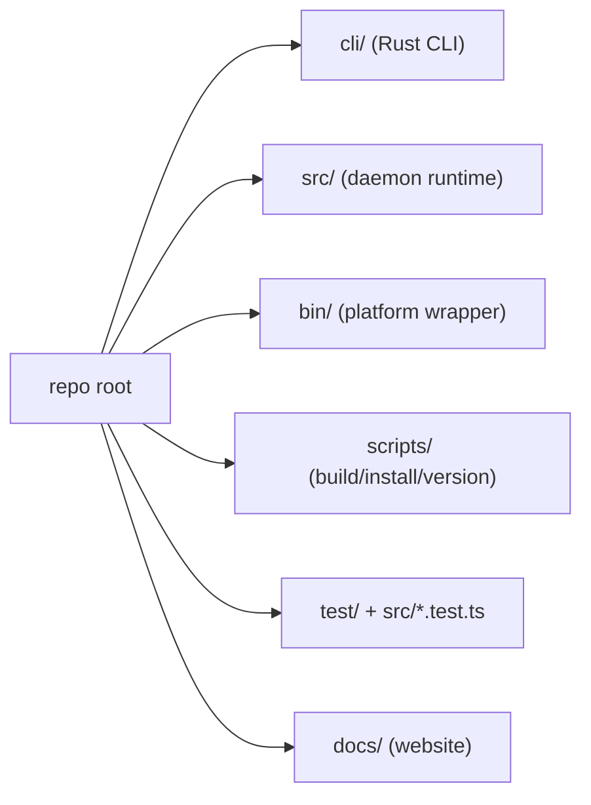

# Architecture Analysis

This document describes the architecture design of the agent-browser codebase, with emphasis on runtime topology, component boundaries, and system data flows. The analysis is based on source in `src/` (TypeScript daemon/runtime), `cli/` (Rust CLI), and supporting scripts in `bin/` and `scripts/`.

## System Overview

agent-browser is a local headless browser automation system composed of:

- A Rust CLI that parses human-friendly commands and formats them into a JSON command protocol.
- A Node.js daemon that owns the browser lifecycle and executes commands.
- Support for desktop browsers (via Playwright) and iOS Safari (via Appium/WebDriverIO).
- Optional streaming support over WebSocket, using CDP screencast frames and input injection.
- Optional remote browser providers (Browserbase, Browser Use, Kernel) accessed via CDP.

The architecture is intentionally split so that the CLI is fast to start and the daemon can be long-lived, maintaining browser state across multiple CLI invocations.

## Component Map

### Primary Runtime Components

- **CLI (Rust)**: `cli/src/*`
  - Parses CLI commands and flags, handles output formatting, and spawns/ensures the Node daemon.
- **Daemon (Node)**: `src/daemon.ts`
  - Creates a local server and dispatches commands to the appropriate manager.
  - Holds either a `BrowserManager` (desktop) or `IOSManager` (iOS) instance, selected by the `--provider` flag or `AGENT_BROWSER_PROVIDER` env var.
  - Exposes a local socket (Unix domain socket on Unix, TCP on Windows) for CLI requests.
  - Rejects HTTP requests on the socket to prevent cross-origin attacks.
- **BrowserManager**: `src/browser.ts`
  - Wraps Playwright Browser/Context/Page management, CDP sessions, routing, tracking, and recording.
- **IOSManager**: `src/ios-manager.ts`
  - Manages iOS Simulator and Safari automation via Appium/WebDriverIO.
  - Provides 1:1 command parity with BrowserManager where possible.
  - Uses `node-simctl` for simulator management and `xcrun xctrace` for real device discovery.
- **iOS Actions**: `src/ios-actions.ts`
  - Command dispatcher for iOS, mirroring `src/actions.ts` but routing to `IOSManager`.
- **Actions Dispatcher**: `src/actions.ts`
  - Central command dispatcher for desktop browsers, mapping each action to a Playwright handler.
- **Protocol**: `src/protocol.ts` + `src/types.ts`
  - Zod-based validation and typed command/response definitions.
- **Snapshot**: `src/snapshot.ts`
  - Builds accessibility-tree-based snapshots with stable refs for AI-friendly selectors.
  - Supports interactive-only filtering, cursor-interactive element detection, depth limiting, compact tree mode, and CSS selector scoping.
- **Stream Server**: `src/stream-server.ts`
  - WebSocket server for frame streaming and input injection (desktop only, not iOS).

### Support Components

- **Binary wrapper**: `bin/agent-browser.js`
  - Node.js ESM wrapper that resolves and spawns the platform-specific native binary.
  - Ensures the binary is executable on macOS/Linux; reports errors if no binary is found.
- **Postinstall**: `scripts/postinstall.js`
  - Downloads platform-native binaries from GitHub releases.
- **Build scripts**: `scripts/build-all-platforms.sh`, `scripts/copy-native.js`
  - Cross-platform build tooling for native CLI binaries.
- **Version scripts**: `scripts/check-version-sync.js`, `scripts/sync-version.js`
  - Ensure version consistency across packages.
- **Docs app**: `docs/`
  - Separate Next.js site; not part of the runtime path described here.

## High-Level Data Flow

## Command Execution Flow (Sequence)

## Runtime Boundaries and IPC

- The CLI and daemon communicate using **newline-delimited JSON** over a local socket.
- The daemon rejects incoming data that begins with an HTTP method (GET, POST, etc.) to prevent cross-origin attacks from browser fetch requests.
- The daemon is single-process and maintains a **single manager** (either `BrowserManager` or `IOSManager`) per session.
- Sessions are isolated by socket path or port computed from `AGENT_BROWSER_SESSION`.
- Session metadata uses PID and port files under a socket directory selected by:
  1. `AGENT_BROWSER_SOCKET_DIR`
  2. `XDG_RUNTIME_DIR` + `/agent-browser`
  3. `~/.agent-browser`
  4. OS temp dir

The design favors local single-user usage with low overhead and stable in-memory browser state.

## Streaming Subsystem

Streaming is optional and off by default. It is only supported with the desktop `BrowserManager`, not iOS. When enabled:

- The daemon starts a WebSocket server on `AGENT_BROWSER_STREAM_PORT` or the default port 9223.
- The server uses CDP `Page.startScreencast` to receive frames.
- Input events (mouse/keyboard/touch) are sent from the viewer to the daemon, which injects them via CDP.

## Provider Modes

The daemon supports multiple provider modes, selected by the `--provider` flag or `AGENT_BROWSER_PROVIDER` environment variable:

### Desktop (default)

The `BrowserManager` supports three primary launch modes:

1. **Local Playwright launch** (default) — chromium, firefox, or webkit
2. **Local CDP connection** to an external Chrome instance
3. **Remote CDP providers** (Browserbase, Browser Use, Kernel)

The mode is selected by the `launch` command parameters and environment variables. CDP connections are validated to ensure contexts and pages exist before the daemon accepts the session.

Additional desktop launch options include `--allow-file-access` for `file://` URL support (Chromium only), custom extensions, proxy configuration, and persistent profiles.

### iOS (`--provider ios`)

The `IOSManager` automates Safari on iOS Simulators or real devices:

- Uses **Appium** with the XCUITest driver for automation.
- Uses **WebDriverIO** as the client library.
- Uses **node-simctl** for simulator lifecycle management.
- Supports device selection via `--device` flag or `AGENT_BROWSER_IOS_DEVICE` / `AGENT_BROWSER_IOS_UDID` env vars.
- A `device_list` command is handled specially in the daemon to enumerate available iOS simulators and real devices without requiring a launched session.

iOS does not support streaming, screencast, tab management, PDF generation, or video recording.

## Architecture Evaluation

### Strengths

- **Clear separation of concerns**: CLI focuses on UX and parsing; daemon handles execution.
- **Stable long-lived state**: a single daemon process maintains browser state across commands.
- **Typed protocol**: Zod validation in `src/protocol.ts` catches malformed commands early.
- **AI-friendly interaction layer**: snapshot refs and `toAIFriendlyError` reduce ambiguity.
- **Cross-platform IPC**: Unix sockets on Unix, TCP on Windows, with consistent session hashing.
- **Optional streaming**: CDP-based preview + input is neatly isolated.
- **Dual-platform support**: desktop and iOS share the same CLI and protocol with provider-specific dispatching.
- **Socket security**: HTTP request rejection prevents cross-origin attacks on the local socket.

### Tradeoffs and Risks

- **Single shared manager per session**: concurrent clients can interleave commands without isolation.
- **Context scoping**: several operations (geolocation, headers, permissions) use `contexts[0]`, which may not match the active page if multiple contexts exist.
- **Stream server trust boundary**: `StreamServer` rejects WebSocket connections from web page origins (via `verifyClient`), but has no authentication for non-browser clients.
- **iOS feature parity**: some desktop commands (tabs, PDF, screencast, recording) are not supported on iOS and return errors.
- **CDP dependency for advanced features**: streaming and input injection require Chromium-compatible CDP.

### Fit for Purpose

The architecture is well-suited for automation by AI agents where session persistence, deterministic element selection, and low-latency command execution are more important than multi-tenant isolation. It is less suited for untrusted multi-user environments without additional access controls.

## Directory-Level Map

