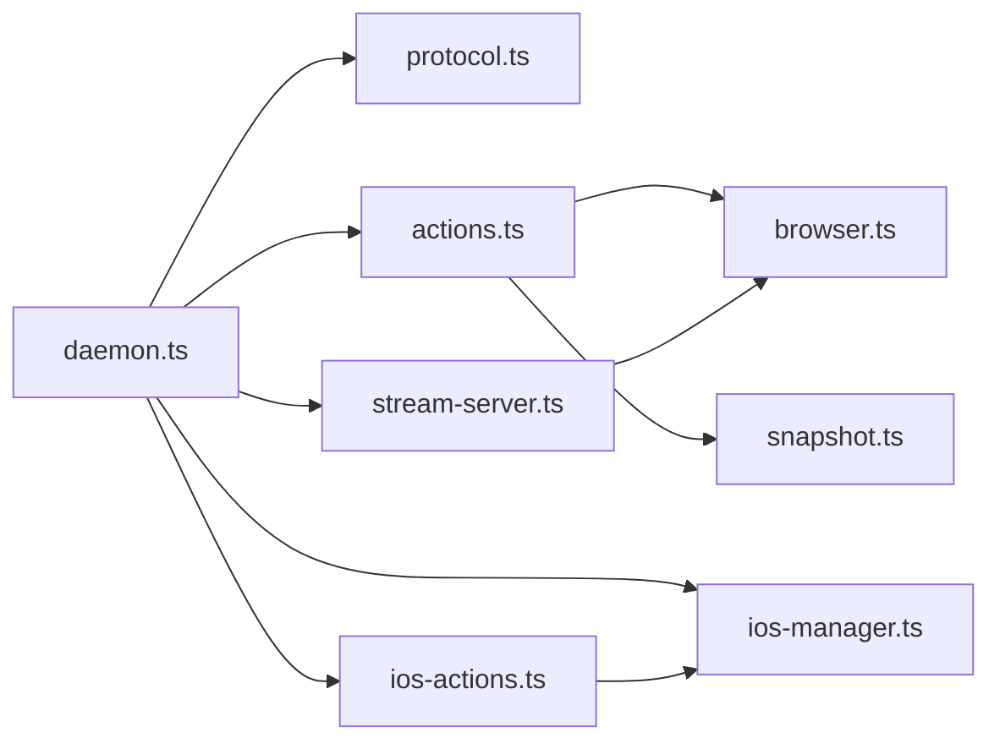
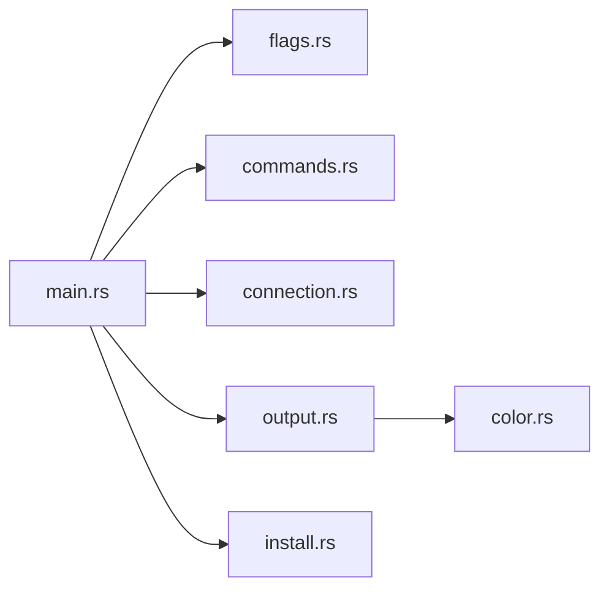

# Implementation Analysis

This document provides a detailed code-level analysis of how agent-browser is implemented. It covers the TypeScript daemon runtime, the Rust CLI, the command protocol, and supporting subsystems.

## TypeScript Runtime (Node Daemon)

### `src/daemon.ts`

Responsibilities:

- Creates a local server (Unix domain socket on Unix, TCP on Windows) and accepts newline-delimited JSON commands.
- Holds either a `BrowserManager` (desktop) or `IOSManager` (iOS) instance, selected by `--provider` or `AGENT_BROWSER_PROVIDER`.
- Routes commands to `executeCommand` (desktop) or `executeIOSCommand` (iOS) based on the active manager.
- Auto-launches a browser/device for non-launch commands using environment defaults.
- Manages session socket/port files and PID files; cleans up on shutdown or errors.
- Optionally starts `StreamServer` when `AGENT_BROWSER_STREAM_PORT` is set (desktop only, default port 9223).
- Handles `device_list` as a special command that creates a temporary `IOSManager` to enumerate devices without requiring a launched session.

Key implementation details:

- Incoming data is buffered and split by `\n`; each line is parsed via `parseCommand`.
- The daemon serializes responses as JSON lines using `serializeResponse`.
- A security check rejects data that starts with an HTTP method (`GET`, `POST`, etc.) to prevent cross-origin socket attacks from browser fetch requests.
- A `close` command is treated specially to allow graceful shutdown.
- Signal handlers cover SIGINT/SIGTERM/SIGHUP plus unhandled errors/rejections for cleanup.
- The `Manager` type is `BrowserManager | IOSManager`, with `instanceof` checks to route commands.

### `src/protocol.ts`

Responsibilities:

- Defines Zod schemas for every command action and validates input.
- Exposes `parseCommand` and response helpers for consistent response formatting.

Key implementation details:

- `commandSchema` is a union of all action-specific schemas.
- Errors return `Validation error: <field>: <message>` to aid debugging.
- All responses are JSON-serialized without framing metadata beyond newline separation.

### `src/types.ts`

Responsibilities:

- Provides TypeScript interfaces for commands, responses, and data payloads.

Notes:

- These types mirror the protocol definitions in `src/protocol.ts`.
- The action list is broad and includes navigation, input, data extraction, network control, media operations, and iOS-specific commands.
- The `LaunchCommand` interface includes `allowFileAccess` for `file://` URL support.

### `src/actions.ts`

Responsibilities:

- Central command dispatcher for desktop browsers. `executeCommand` maps each action to a handler.
- Converts Playwright errors into AI-friendly messages via `toAIFriendlyError`.
- Bridges screencast callbacks from the stream server to `BrowserManager`.

Key implementation patterns:

- Most handlers use `browser.getLocator`, which supports both refs (`@e1`) and selectors.
- Errors are normalized for common cases: strict mode violations, occluded elements, and timeouts.
- Commands are implemented in grouped categories:
  - **Navigation**: `navigate`, `back`, `forward`, `reload`, `url`, `title`, `bringtofront`.
  - **Input**: `click`, `dblclick`, `type`, `fill`, `press`, `keydown`, `keyup`, `inserttext`, `scroll`, `scrollintoview`, `drag`, `hover`, `tap`, `focus`, `check`, `uncheck`, `upload`, `select`, `multiselect`, `clear`, `selectall`, `setvalue`, `dispatch`.
  - **Locators**: `getbyrole`, `getbytext`, `getbylabel`, `getbyplaceholder`, `getbyalttext`, `getbytitle`, `getbytestid`, `nth`.
  - **Query and extraction**: `gettext`, `getattribute`, `innertext`, `innerhtml`, `inputvalue`, `isvisible`, `isenabled`, `ischecked`, `count`, `boundingbox`, `styles`, `content`.
  - **Frames**: `frame`, `mainframe`.
  - **Waits**: `wait`, `waitforurl`, `waitforloadstate`, `waitforfunction`, `waitfordownload`, `pause`.
  - **Tabs and windows**: `tab_new`, `tab_list`, `tab_switch`, `tab_close`, `window_new`.
  - **State**: `cookies_get`, `cookies_set`, `cookies_clear`, `storage_get`, `storage_set`, `storage_clear`, `state_save`, `state_load`, `setcontent`.
  - **Permissions and context**: `geolocation`, `permissions`, `viewport`, `useragent`, `device`, `offline`, `headers`, `emulatemedia`, `timezone`, `locale`, `credentials`.
  - **Evaluation**: `evaluate`, `evalhandle`, `expose`, `addscript`, `addstyle`, `addinitscript`.
  - **Media**: `screenshot`, `snapshot`, `pdf`, `video_start`, `video_stop`, `recording_start`, `recording_stop`, `recording_restart`, `screencast_start`, `screencast_stop`.
  - **Network**: `route`, `unroute`, `requests`, `download`, `responsebody`.
  - **Diagnostics**: `console`, `errors`, `highlight`, `dialog`.
  - **Low-level input**: `keyboard`, `wheel`, `mousemove`, `mousedown`, `mouseup`, `input_mouse`, `input_keyboard`, `input_touch`.
  - **Clipboard**: `clipboard` (copy, paste, read).
  - **Tracing**: `trace_start`, `trace_stop`, `har_start`, `har_stop`.

### `src/ios-actions.ts`

Responsibilities:

- Command dispatcher for iOS Safari, mirroring `actions.ts` but routing to `IOSManager`.
- Provides 1:1 command parity where possible; returns explicit errors for unsupported commands.

Key implementation details:

- Supported iOS actions: `launch`, `navigate`, `click`, `tap`, `type`, `fill`, `screenshot`, `snapshot`, `scroll`, `swipe`, `evaluate`, `wait`, `press`, `hover`, `content`, `gettext`, `getattribute`, `isvisible`, `isenabled`, `url`, `title`, `back`, `forward`, `reload`, `select`, `check`, `uncheck`, `focus`, `clear`, `count`, `boundingbox`, `close`, `device_list`.
- Unsupported actions that return errors: `tab_new`, `tab_list`, `tab_switch`, `tab_close`, `window_new`, `pdf`, `screencast_start`, `screencast_stop`, `recording_start`, `recording_stop`, `recording_restart`.
- iOS-specific action: `swipe` (direction-based swipe gesture).

### `src/ios-manager.ts` (IOSManager)

Responsibilities:

- Manages iOS Simulator and Safari automation via Appium/WebDriverIO.
- Provides 1:1 command parity with `BrowserManager` for iOS Safari.
- Handles Appium process lifecycle (start/stop).
- Manages device discovery for both simulators and real devices.

Key implementation details:

- Uses `node-simctl` (`Simctl` class) for simulator management.
- Uses `webdriverio` (`remote()`) to connect to Appium.
- Uses `xcrun xctrace list devices` to discover connected real iOS devices.
- Appium connects on `127.0.0.1:4723` by default.
- Maintains its own ref map (`IOSRefMap`) for element targeting, mirroring the desktop `snapshot.ts` approach.
- Tracks console messages and generates accessibility snapshots with refs.
- Device selection supports both simulator name matching and explicit UDID targeting.

### `src/browser.ts` (BrowserManager)

Responsibilities:

- Owns Playwright `Browser`, `BrowserContext`, and `Page` lifecycles.
- Manages active page/frame selection and tab/window creation.
- Provides CDP session handling for screencast and low-level input injection.
- Implements recording via Playwright video capture in a separate context.
- Tracks requests, console messages, and page errors.

Key implementation details:

- Launch logic supports:
  - Local launch (chromium/firefox/webkit)
  - CDP connection to a running browser
  - Remote providers (Browserbase, Browser Use, Kernel)
- Launch constraints are validated (for example, extensions cannot be used with CDP).
- `allowFileAccess` is only supported in Chromium; adds `--allow-file-access-from-files` and `--allow-file-access` flags. Note: `allowFileAccess` is not present in the Zod `launchSchema` in `protocol.ts`; for explicit `launch` commands via JSON protocol, the field would be stripped by validation. The primary use case (auto-launch via `AGENT_BROWSER_ALLOW_FILE_ACCESS` env var in `daemon.ts`) bypasses protocol validation and works correctly.
- Kernel provider support: `connectToKernel()` creates sessions via `https://api.onkernel.com/browsers`, with profile management via `findOrCreateKernelProfile()`. Requires `KERNEL_API_KEY`; optional env vars: `KERNEL_PROFILE_NAME`, `KERNEL_HEADLESS`, `KERNEL_STEALTH`, `KERNEL_TIMEOUT_SECONDS`.
- CDP sessions are cached per active page and invalidated on tab switches.
- Recording creates a new context with `recordVideo` and transfers storage state when possible.
- Scoped header support uses `page.route` to inject headers for specific origins.

Potential considerations (implementation-level):

- Several features use `contexts[0]` rather than resolving the context that owns the active page.
- Request tracking is per-page and must be enabled on the active page; new pages do not automatically inherit existing tracking listeners.
- Streaming and input injection depend on Chromium CDP support.

### `src/snapshot.ts`

Responsibilities:

- Builds an accessibility-tree snapshot and assigns stable refs.
- Supports filters for interactive-only output, cursor-interactive detection, compact tree mode, depth limiting, and CSS selector scoping.

Key implementation details:

- Uses Playwright `ariaSnapshot` and post-processes the tree.
- Interactive roles receive refs (`e1`, `e2`, ...); duplicates track `nth` indexes.
- `parseRef` accepts `@e1`, `ref=e1`, or `e1` formats.
- `compact` removes structural-only nodes without meaningful content.
- `cursor` option detects elements with `cursor: pointer`, `onclick` handlers, or `tabindex` attributes that are not part of the standard interactive role set.
- `maxDepth` limits how deep the tree is traversed.
- `selector` scopes the snapshot to a specific CSS selector.
- Note: the `cursor` option is supported in the `SnapshotOptions` interface and action handler but is not present in the Zod `snapshotSchema` in `protocol.ts`; it only works via the `as any` cast in the action handler or when passed through auto-launch paths.

### `src/stream-server.ts`

Responsibilities:

- Runs a WebSocket server for streaming and input events (desktop only).
- Broadcasts CDP screencast frames to connected clients.

Key implementation details:

- Uses a global callback set by `setScreencastFrameCallback` in `src/actions.ts`.
- First client starts screencast; last client stops it.
- Supports `input_mouse`, `input_keyboard`, and `input_touch` messages.
- A `verifyClient` callback rejects WebSocket connections from web page origins (any origin that is not empty and does not start with `file://`), preventing cross-origin attacks from malicious web pages.

## Rust CLI

### `cli/src/main.rs`

Responsibilities:

- CLI entry point with flag parsing, help/version, and routing.
- Starts the daemon when needed and sends a single command per invocation.

Key implementation details:

- Uses `parse_command` to map CLI args to JSON command objects.
- Calls `ensure_daemon` before sending commands.
- Handles special subcommands (`install`, `session`) without starting the daemon.

### `cli/src/commands.rs`

Responsibilities:

- Maps CLI verbs to protocol actions and validates argument structure.

Key implementation details:

- Adds `https://` for URL inputs missing a scheme.
- Encodes most commands as single JSON objects with an `id` field.
- Uses `gen_id` for request ids based on a microsecond timestamp fragment.

### `cli/src/connection.rs`

Responsibilities:

- Starts or connects to the Node daemon.
- Sends a JSON command and waits for a single JSON response line.

Key implementation details:

- Determines daemon JS path relative to the running binary or `AGENT_BROWSER_HOME`.
- Spawns `node <daemon.js>` in a detached process group.
- Uses Unix sockets on Unix and TCP on Windows; computes port per session name.
- Read and write timeouts are set to avoid blocking indefinitely.

### `cli/src/flags.rs`

Responsibilities:

- Parses global flags and env defaults that influence the daemon launch.
- Tracks which launch-time options were passed via CLI vs environment variables (`cli_*` booleans).

Notable flags:

- `--json` for machine output
- `--full` / `-f` for full output
- `--headed` to disable headless mode
- `--debug` for debug mode
- `--session` to select socket namespace
- `--cdp` for CDP URL connection
- `--executable-path` for custom browser binary
- `--extension` for loading browser extensions
- `--profile` for persistent browser profile
- `--state` for storage state file
- `--proxy` and `--proxy-bypass` for proxy configuration
- `--args` for additional browser args
- `--user-agent` for custom user agent
- `-p` / `--provider` for provider selection (e.g., `ios`)
- `--ignore-https-errors` to bypass certificate errors
- `--allow-file-access` to enable `file://` URL support (Chromium only)
- `--device` for iOS device selection
- `--headers` for custom request headers

### `cli/src/output.rs`

Responsibilities:

- Formats response output for human-readable CLI mode.

Key implementation details:

- Inspects response payloads to decide specialized formatting (snapshot, logs, cookies, etc).
- Uses `cli/src/color.rs` for colored output with NO_COLOR support.

### `cli/src/install.rs`

Responsibilities:

- Installs Playwright Chromium and optional Linux system dependencies.
- Uses `npx playwright install chromium` as the primary install mechanism.

## Test Surface

- TypeScript unit tests: `src/*.test.ts` using Vitest
  - `src/protocol.test.ts` — command parsing and protocol validation.
  - `src/actions.test.ts` — action handler behavior.
  - `src/daemon.test.ts` — daemon helpers (socket paths, session management).
  - `src/browser.test.ts` — browser manager unit tests.
  - `src/ios-manager.test.ts` — iOS manager unit tests.
- TypeScript integration tests: `test/*.test.ts` using Vitest
  - `test/launch-options.test.ts` — browser launch option combinations.
  - `test/serverless.test.ts` — serverless/remote provider scenarios.
  - `test/file-access.test.ts` — `file://` URL access functionality.
- Rust tests: in `cli/src/*` for utility behaviors (flags, socket dir, etc).

## Module Relationships

### Daemon-side Modules

### CLI-side Modules

## Implementation Evaluation

### Strengths

- **Robust Playwright integration** in `BrowserManager` with explicit error handling for common UI failures.
- **Protocol validation** via Zod protects the daemon from malformed input.
- **Ref-based selection** improves determinism for AI agents compared to brittle CSS selectors.
- **Incremental feature layering**: streaming, recording, and CDP features are optional and do not affect core flows.
- **Dual-platform support**: iOS and desktop share the same protocol and command structure with clean dispatching.
- **Socket security**: HTTP method detection prevents cross-origin attacks on the local socket.

### Risks and Gaps

- **Single-daemon shared state**: no per-client isolation; concurrent connections can interleave actions.
- **Context ambiguity**: several operations use `contexts[0]`, which can diverge from active tab context in multi-window usage.
- **ID collisions**: `gen_id` uses microsecond time modulo 1,000,000; high-frequency commands could collide.
- **iOS feature gaps**: tab management, PDF, screencast, and recording are unsupported on iOS and return errors.

### Suggested Follow-ups (non-invasive)

- Consider routing context-scoped operations to `page.context()` instead of `contexts[0]`.
- Introduce a per-connection command queue or mutex for multi-client safety.
- Optional: add a monotonic counter to `gen_id` to reduce collision risk.
